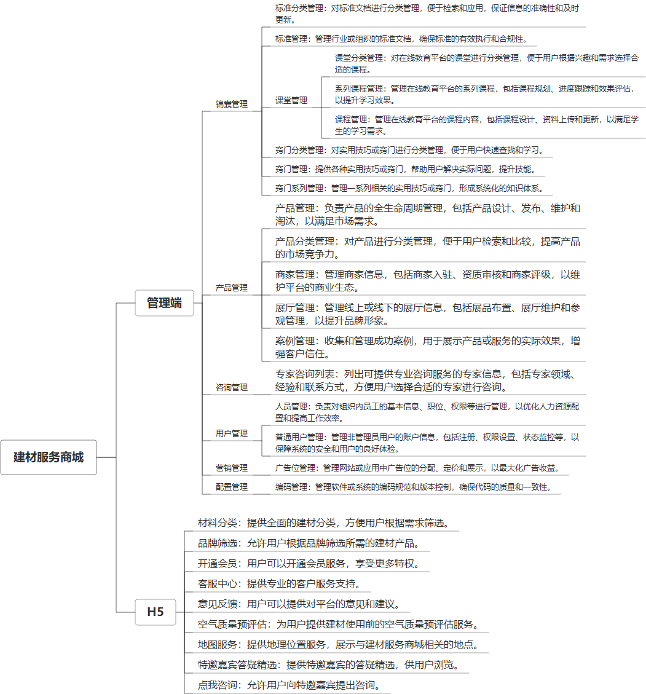

 

    
 

公司拥有上百套具有自主知识产权的软件系统，详情请查看码云首页或公司官网

 
<h1>家装商城</h1>

<a href="https://www.haishi.net.cn/">公司官网</a> ｜ <a href="https://www.haishi.net.cn/">在线体验</a>

 

## 系统介绍

包含教程、商品销售、广告等各类功能
包含教程、商品销售、广告等各类功能
----------------------------------
本项目名称为建材服务商城系统，是面向建材行业提供服务和产品销售的电子商务平台。该系统旨在为建材供应商、服务商和消费者搭建一个便捷、高效的交易和服务平台，促进建材行业的数字化转型和发展。
本项目从用户层面可以分为两个端：管理端、用户端。
- 管理端：公司内部管理员用户使用，可以进行商品管理、订单管理、用户管理、营销管理等。
- 用户端 App：外部客户使用，可以浏览商品、下单购买、查看订单、联系客服等。
---
                

## 系统功能介绍

### 系统包含终端说明

管理端（WEB）、用户端（微信小程序）

| 序号 | 模块               | 模块说明 |
| ---- | ------------------ | -------- |
| 1    | FWY-SHOP-JZ-MANAGE | 管理端   |
| 2    | FWY-SHOP-JZ-SERVER | 服务端   |
| 3    | FWY-SHOP-JZ-MP     | 小程序   |

### 系统功能结构

### 系统功能说明

- 锦囊管理：提供建材行业知识、技能和经验分享，包括标准分类管理、标准管理、课堂管理、窍门分类管理、窍门管理、窍门系列管理等功能。
- 产品管理：提供建材产品展示和销售，包括产品分类管理、商家管理、展厅管理、产品管理、案例管理等功能。
- 营销管理：提供营销活动策划和执行，包括广告位管理等功能。
- 用户管理：提供用户账户管理和服务，包括人员管理、普通用户管理等功能。

## 系统主要界面

## 系统技术说明

### 代码模块说明

| 序号 | 目录                                  | 目录说明 |
| ---- | ------------------------------------- | -------- |
| 1    | FWY-SHOP-JZ-SERVER/zhenyoucai-dao     | --       |
| 2    | FWY-SHOP-JZ-SERVER/zhenyoucai-service | --       |
| 3    | FWY-SHOP-JZ-SERVER/zhenyoucai-common  | --       |
| 4    | FWY-SHOP-JZ-SERVER/zhenyoucai-app     | --       |
| 5    | FWY-SHOP-JZ-SERVER/.idea              | --       |

### 系统技术选型

#### 开发语言/框架

JAVA（JDK1.8）
前端框架：VUE2

#### 服务中间件

Nginx
Tomcat

#### 数据库

MySQL（5.7+）
Redis

#### 其他说明

无

## 系统演示/商用

请扫码添加客服微信获取演示地址和系统详细资料。

如果您想基于家装商城进行商业化交付或定制开发服务，我们提供有偿的技术服务支持，合作模式不限，欢迎沟通！

公司官网地址： <a href="https://www.haishi.net.cn/">https://www.haishi.net.cn</a>

联系客服获取专业回答。

## 使用须知

1、 本项目商用必须获得版权所有者的授权。

2、 未经允许本项目代码不允许二次出售。

